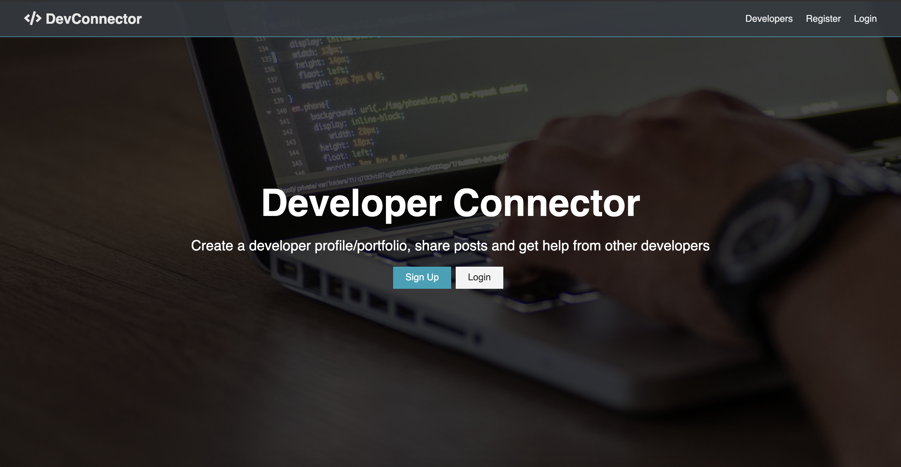
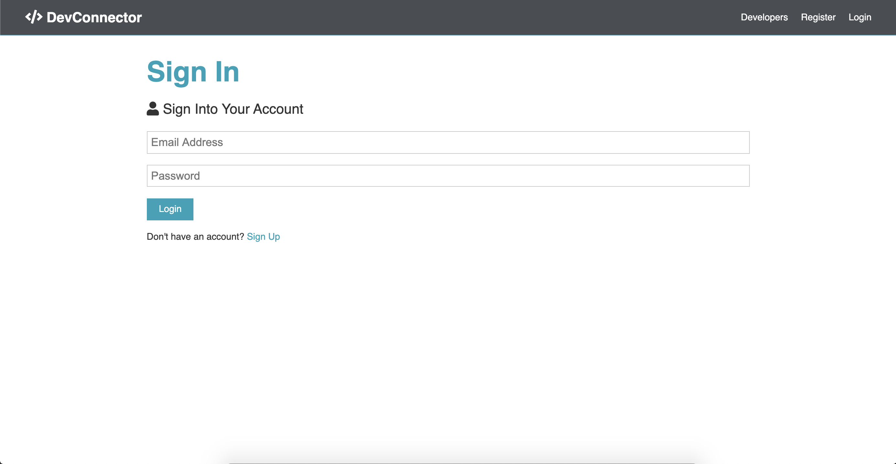
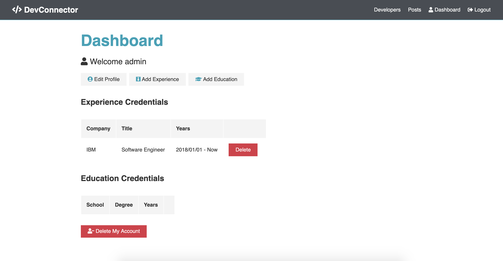
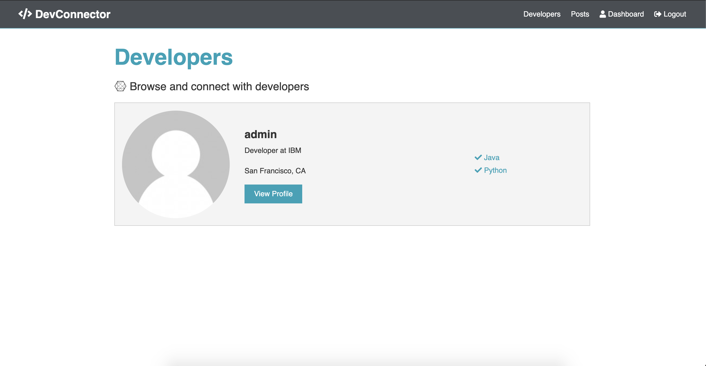

# MERN Stack Social Network for Developers

This is a MERN stack application that is a social network for software developers. The application includes user authentication, and profile creation. Technologies used are MongoDB, Express, React, Redux and Node.js. The application is based off a Udemy course of the same name. 

# Application Flow






# Table of Contents

- [Quick Start](#quick-start---)
    + [Add a default.json file in config folder with the following](#add-a-defaultjson-file-in-config-folder-with-the-following)
    + [Install server dependencies](#install-server-dependencies)
    + [Install client dependencies](#install-client-dependencies)
    + [Run both Express & React from root](#run-both-express---react-from-root)
    + [Build for production](#build-for-production)
    + [Test production before deploy](#test-production-before-deploy)
    + [Deploy to Heroku](#deploy-to-heroku)
- [Application Topics](#application-topics)
  * [1: Overview and Environment Setup](#1--overview-and-environment-setup)
    + [Project Coverage](#project-coverage)
    + [Project Overview](#project-overview)
    + [Environment & Setup](#environment---setup)
  * [2: Express & MongoDB Setup](#2--express---mongodb-setup)
    + [MongoDB Atlas Setup](#mongodb-atlas-setup)
    + [Install Dependencies & Basic Express Setup](#install-dependencies---basic-express-setup)
    + [Connecting To MongoDB With Mongoose](#connecting-to-mongodb-with-mongoose)
    + [Route Files With Express Router](#route-files-with-express-router)
  * [3: User API Routes & JWT Authentication](#3--user-api-routes---jwt-authentication)
    + [Creating The User Model](#creating-the-user-model)
    + [Request & Body Validation](#request---body-validation)
    + [User Registration](#user-registration)
    + [Implementing JWT](#implementing-jwt)
    + [Custom Auth Middleware & JWT Verify](#custom-auth-middleware---jwt-verify)
    + [User Authentication / Login Route](#user-authentication---login-route)
  * [4: Section 4: Profile API Routes](#4--section-4--profile-api-routes)
    + [Creating The Profile Model](#creating-the-profile-model)
    + [Route for Get Current User Profile](#route-for-get-current-user-profile)
    + [Create & Update Profile Route](#create---update-profile-route)
    + [Routes for Get All Profiles & Profile By User ID](#routes-for-get-all-profiles---profile-by-user-id)
    + [Route for Delete Profile & User](#route-for-delete-profile---user)
    + [Add Profile Experiences](#add-profile-experiences)
    + [Delete Profile Experience](#delete-profile-experience)
    + [Add & Delete Profile Education](#add---delete-profile-education)
    + [Get Github Repos For Profile](#get-github-repos-for-profile)
  * [5: Post API Routes](#5--post-api-routes)
    + [Creating The Post Model](#creating-the-post-model)
    + [Add Post Route](#add-post-route)
    + [Get & Delete Posts Routes](#get---delete-posts-routes)
    + [Posts Like & Unlike Routes](#posts-like---unlike-routes)
    + [Add & Remove Comment Routes](#add---remove-comment-routes)
  * [6: React & The Frontend](#6--react---the-frontend)
    + [React & Concurrently Setup](#react---concurrently-setup)
    + [Clean Up & Initial Components](#clean-up---initial-components)
    + [React Router Setup](#react-router-setup)
    + [Register Form & useState Hook](#register-form---usestate-hook)
    + [Login Form](#login-form)
  * [7: Redux Setup & Alerts](#7--redux-setup---alerts)
    + [The Gist Of Redux](#the-gist-of-redux)
    + [Creating a Redux Store](#creating-a-redux-store)
    + [Alert Reducer, Action & Types](#alert-reducer--action---types)
    + [Alert Component & Action Call](#alert-component---action-call)
  * [8: React User Authentication](#8--react-user-authentication)
    + [Auth Reducer & Register Action](#auth-reducer---register-action)
    + [Load User & Set Auth Token](#load-user---set-auth-token)
    + [User Login](#user-login)
    + [Logout & Navbar Links](#logout---navbar-links)
  * [9: Dashboard & Profile Management](#9--dashboard---profile-management)
    + [Protected Route For Dashboard](#protected-route-for-dashboard)
    + [Profile Reducer & Get Current Profile](#profile-reducer---get-current-profile)
    + [Starting On The Dashboard](#starting-on-the-dashboard)
    + [CreateProfile Component](#createprofile-component)
    + [Create Profile Action](#create-profile-action)
    + [Edit Profile](#edit-profile)
    + [Add Education & Experiences](#add-education---experiences)
    + [List Education & Experiences](#list-education---experiences)
    + [Delete Education, Experiences & Account](#delete-education--experiences---account)
  * [10: Profile Display](#10--profile-display)
    + [Finish Profile Actions & Reducer](#finish-profile-actions---reducer)
    + [Display Profiles](#display-profiles)
    + [Addressing The Console Warnings](#addressing-the-console-warnings)
    + [Starting On The Profile](#starting-on-the-profile)
    + [ProfileTop & ProfileAbout Components](#profiletop---profileabout-components)
    + [Profile Experience & Education Display](#profile-experience---education-display)
    + [Displaying Github Repos](#displaying-github-repos)
    + [Profile State Issue & Fix](#profile-state-issue---fix)
  * [11: Posts & Comments](#11--posts---comments)
    + [Post Reducer, Action & Initial Component](#post-reducer--action---initial-component)
    + [PostItem Component](#postitem-component)
    + [Like & Unlike Functionality](#like---unlike-functionality)
    + [Deleting Posts](#deleting-posts)
    + [Adding Posts](#adding-posts)
    + [Single Post Display](#single-post-display)
    + [Adding Comments](#adding-comments)
    + [Comment Display & Delete](#comment-display---delete)
  * [12. Updates](#12-updates)
    + [Changes to GitHub API authentication](#changes-to-github-api-authentication)
      - [npm package request depreciated](#npm-package-request-depreciated)
    + [uuid no longer has a default export](#uuid-no-longer-has-a-default-export)
    + [Addition of normalize-url package](#addition-of-normalize-url-package---)
    + [Fix broken links in gravatar](#fix-broken-links-in-gravatar---)
    + [Redux subscription to manage local storage](#redux-subscription-to-manage-local-storage---)
    + [Component reuse](#component-reuse---)
    + [Log user out on token expiration](#log-user-out-on-token-expiration---)

# Quick Start

### Add a default.json file in config folder with the following

```
{
  "mongoURI": "<your_mongoDB_Atlas_uri_with_credentials>",
  "jwtSecret": "secret",
  "githubToken": "<yoursecrectaccesstoken>"
}
```

### Install server dependencies

```bash
npm install
```

### Install client dependencies

```bash
cd client
npm install
```

### Run both Express & React from root

```bash
npm run dev
```

### Build for production

```bash
cd client
npm run build
```

### Test production before deploy

After running a build in the client 👆, cd into the root of the project.  
And run...

```bash
NODE_ENV=production node server.js
```

Check in browser on [http://localhost:5000/](http://localhost:5000/)

### Deploy to Heroku

If you followed the sensible advice above and included `config/default.json` `and config/production.json` in your .gitignore file, then pushing to Heroku will omit your config files from the push.  
However, Heroku needs these files for a successful build.  
So how to get them to Heroku without commiting them to GitHub?

What I suggest you do is create a local only branch, lets call it _production_.

```bash
git checkout -b production
```

We can use this branch to deploy from, with our config files.

Add the config file...

```bash
git add -f config/production.json
```

This will track the file in git on this branch only. **DON'T PUSH THE PRODUCTION BRANCH TO GITHUB**

Commit...

```bash
git commit -m 'ready to deploy'
```

Create your Heroku project

```bash
heroku create
```

And push the local production branch to the remote heroku master branch.

```bash
git push heroku production:master
```

Now Heroku will have the config it needs to build the project.

> **Don't forget to make sure your production database is not whitelisted in MongoDB Atlas, otherwise the database connection will fail and your app will crash.**

After deployment you can delete the production branch if you like.

```bash
git checkout master
git branch -D production
```

Or you can leave it to merge and push updates from another branch.  
Make any changes you need on your master branch and merge those into your production branch.

```bash
git checkout production
git merge master
```

Once merged you can push to heroku as above and your site will rebuild and be updated.


# Application Topics

## 1: Overview and Environment Setup

### Project Coverage

Project coverage:
- *VSCode*: text editor, with several added extensions
- *ES6*+: arrow functions, promises, asyncwait
- *React Hooks*: for functional components on the client
- *Redux with Dev Tools*: Redux for state management, Dev Tools for authentication
- *JWT (JSON Web Tokens)*
- *Postman HTTP Client*: for making requests to API to test endpoints
- *Mongoose / MongoDB / Atlas*: MongoDB Atlas to host our DB on the cloud, Mongoose for database abstraction layer
- *Bcrypt Password Hashing*: for password encryption
- *Heroku + Git Deployment*

### Project Overview

We have a landing page to sign up or log in. We can view list of users and profiles without being logged in. There is a bio page to add job experience and education, as well as dates, job descriptions, education, and field of study. We can grab a user's github repos. 

Registration and login are handled with a JSON web token. Once logged in, there is a dashboard to edit experience and education, as well as other fields, and to delete an account. Alerts are handled with reducers. We can also connect social networks.

In Posts, we can see posts in the database. We can add, delete, and like posts. We also have a discussion section for comments, and go to a single post where we can leave a comment. 

### Environment & Setup

VSCode Extensions:
- *Bracket pair colorizer* - to visually organize blocks
- *ES7 Redact Redux GraphQL React Native Snippets* - generate components, proptypes, write code much faster
- *Prettier* - code formatter. can set to format on save in Settings

## 2: Express & MongoDB Setup

### MongoDB Atlas Setup

Install MongoDB in cloud using Mongo Atlas. It's easier to manage than the local version of Mongo DB. It's also easier for consistency between diff platforms and OS. Make a free account, create a project, and build a cluster.

### Install Dependencies & Basic Express Setup

We build our Express server and API now. To create a package.json, do `npm init` and make sure our entry point is `server.js`. Install our package dependencies with `npm install <package name>`. Related to express, we use:
- `express` itself
- `express-validator` for data validation of POST requests to Express API
- `bcrypt` for password encryption
- `config` for global viarables
- `gravatar` for profile avatars. If a user signs up, they can use an email associated with that gravitar account and it wll automatically show their profile image. 
- `jsonwebtoken` for JWT token validation
- `mongoose` as an abstraction layer on top of database so we can interact with the database
-  `request` to make HTTP requests to another API, since we're going to make a request to GitHub to get the GitHub repositories. We do the request from our backend to hide our API key.

We also install our dev dependencies using `npm install -D <package name>`. We yse:
- `nodemon` to constantly watch our server so we don't have to refresh it every time we make a change
- `concurrently` to run back end Express server and front end React server at the same time with one single command via `npm run dev`

`server.js` is our main entry file. Bring in express and our PORT (either defined in our environment or 5000 as the default). The app listens for a connection on the port and once it gets one, it prints out the port number where the server started on `console.log`.

In `package.json`, we include scripts into our npm package. i.e. running `npm run server` will run the script `nodemon server`, etc. 

In Postman, if we make a GET request to `http://localhost:5000` and send, we can see the result of the request. The GET request is defined as `app.get` in `server.js`. 


### Connecting To MongoDB With Mongoose

Add all of our default constants into `config/default.json`. Here, we can add the connection string to Mongo (`MongoURI`). We can do the actual MongoDB connection in `config/db.js`. We use the mongoose package to connect to MongoDB via `mongoose.connect(db)`. We can use `connectDB` as an async arrow function. `mongoose.connect(db)` returns a promise, and we want to await for that. All of this is done in a try/catch block. Lastly, we want to export the `connectDB` function to use in `server.js`.

In `server.js`, connect the DB after where Express is initialized. 

**NOTE: Make sure our IP is whitelisted in MongoDB Atlas. On the sidebar of our cluster, this is found in Network Access --> IP Whitelist.**

### Route Files With Express Router

We create files for our routes in the `routes/api/` folder, and break it up by resource (user, auth, profile, and post routes). The routes are:

- `users.js` - handles registering users
- `auth.js` - handles getting JWT for authentication
- `profile.js` - handles routes for adding, fetching, updating profiles
- `posts.js` - form to add posts, like, comment

For the routes, `router = express.Router();` for if we have routes in separate files. Doing an individual `app.get`, `app.post`... etc. for all cases would get messy. So we use `express.Router` to break it up into different resources. 

Set up the GET request route for the different routes. `router.get('/', (req, res) => res.send('Message here'));` . For the callback, use and end point of `/` and an arrow function with the request response and do a `res.send`. We can also set notes for the route, route description, and the access (public or private) where private means you need a token to be authenticated for the route to work.

Export the route with `module.exports = router`. 

In `server.js`, define the routes, i.e. `app.use('/api/users', require('./routes/api/users'));` for users. 

## 3: User API Routes & JWT Authentication

### Creating The User Model

Now, will be working on building out the User route. We want to register a user and do authentication. To interact with the database, we create a model for the User (will do the same for Profile, Post, etc.)

We store all the models in the `models/` folder. Create `User.js` in there, with a capital first letter for the naming convention of models. To create the model, we create a schema called `UserSchema` to hold the different fields we want. We can do so with `mongoose.Schema`. The fields are name, email password, avatar, and date. We can also add the type of the field, whether or not it is required or unique, etc. 

### Request & Body Validation

We create a POST request route in `Users.js`, i.e. `router.post`. We need to send a name, email, and password to register a user. We can store these values from the request body i.e. `const { name, email, password } = req.body`.  

For `req.body` to work, we need to initialize the middleware for the body parser which is included with Express. We can bring this in as middleware in `server.js`, via `app.use(express.json())`. We can test `res.send` for a POST request in Postman to see that it works.

For the name, email, and password, we can use the express-validator package to do the check. We  bring in check and validationResult to do it i.e. `const { check, validationResult } = require('express-validator')`. Then, add check fields, like non-empty name and password length. If we get errors from the validationResult from the async response, send back a 400 error status as an errors JSON.

### User Registration

Now, we add logic to register our users in `users.js`. We want to see if the user exists. Then, get the user's gravatar (as part of user). Encrypt the password using `bcrypt`. Return the `jsonwebtoken`. When a user registers, we want them to be logged in right away. To be logged in, we need the JWT. 

Seeing if user exists - Grab the name, email, and password from the request body `req.body`. Bring in the User model i.e. `const User = require('../../models/User');`. We want to see if the User model finds the email of the user asynchronously using await. If a user exists, return a JSON 400 error. 

NOTE: `useCreateIndex: true` in `config/db.js` is used to get rid of a DeprecationWarnning for `collection.ensureIndex.` So we use createIndex instead.

Getting the user's gravatar - Make sure you have gravatar installed (`npm install gravatar`, it should be in our `package.json` file). Pass the user's email into a method `gravatar.url` to get the URL of the gravatar. Pass in s (default size, string of 200), r (rating, PG, so vulgar pics), and mm (a default image). Then, we create an instance of a user.

Encrypting the password - we create a salt to do the hashing width. A salt is random data that is used as an additional input to a one-way function to hash data / a password. Generate a salt with bcrypt and do 10 rounds. To encrypt the `user.password`, we hash the unencrypted passowrd with the salt. Finally, save the user. 

Resolve returning the jsonwebtoken in the next section.

NOTE: We put the async `await` in front of anything that returns a promise. 

### Implementing JWT

jwt.io is a website that breaks down what is in a JWT token. There are three parts: the header (contains token type, algorithm), the payload (contains the data -- usually user, issued at), and the signature. 

How the JWT call works - Install the `jsonwebtoken` package. Sign it and pass in our payload, and have a callback where we send the response data back to client with the token. We need to protect our routes by creating middleware to verify the token (`jwt.verifytoken`). This gets sent through HTTP headers and we can verify it i.e. allow users access or send back a response if invalid. 

Bring in JWT into `users.js` i.e. `const jwt = require('jsonwebtoken');`. Bring in `config` for the `jwtSecret`. We store the `payload` into a variable with the user object and store a user's `user.id`. When the user gets saved, it returns a promise where we can retrieve that `user.id`. We sign the token via `jwt.sign` takes in the payload, a secret (which we store in `config/default.json`), and an expiration time. Have a callback that either responds the error or the json of the token. 

### Custom Auth Middleware & JWT Verify

Now, send the token back to authenticate and access protected routes. We create a custom folder called `middleware` to take care of the boilerplate stuff for authorization, etc.

In `auth.js`, bring in `jwt` and `config` and export that middleware function. The middleware function has access to the request and response cycle objects. We also bring in next so that it moves on to the next piece of middleware in the cycle. 

In `module.exports`, we want to get the token from the header. when we send a request to a protected route, we want to add the token to the header. Get the token from the request header and the header key we want to send the token in is is `x-auth-token`. If no token, respond a 401 not authorized response. If there is a token, verify it with `jwt.verify` and the secret to decode it. Take the request object and assign it to the user using the decoded user. We can now use the `req.user` in any of our protected routes, like for getting the user's profile. Then, call `next` like we do on any piece of middleware to call the next middleware piece. 

We want to put this auth function in a protected route. In `routes/api/auth.js`, bring in the middleware function `const auth = require('../../middleware/auth');` and use the `auth` middleware as a second parameter in the GET route. This makes the route protected. To get the user data in the route as a json response, do `const user = await User.findById(req.user.id).select('-password');` . Get the user data, minus the password. 

### User Authentication / Login Route

We want to log in with the users that are already in the database in `routes/api/auth.js`. We make a POST route here to authenticate user and get token, making it a public route. The purpose of this route is to get the token to make requests to private routes.

POST method is similar to the one for `users.js` with several differences. We only check if password exists, not the length. We don't send the name since it's just a log in -- only email and password. If user DOESN'T exist, respond with a message for invalid credentials. For the found user, we need to make sure the password matches. Bcrypt has a method to compare an encrypted password in the database (`user.password`) and plaintext password that user enters (`password`). The promise returns by `isMatch` is checked to see if credentials are valid. The process of creating the payload and sending it to get back the repsonse token is the same as `users.js`. 

## 4: Section 4: Profile API Routes

### Creating The Profile Model

We keep a `models/profile.js` for our Profile Model. The model is like the User model but with more fields. For the ProfileSchema, we want every profile to be associated with a user, so connect the profile id of a user in the database to the model. Also add a reference to the user model. i.e.   
```
user: {
    type: mongoose.Schema.Types.ObjectId,
    ref: 'user'
  }
```

The rest of the fields in the Profile model are as follows - company, website, location, status (dropdown for their job function, required), skills (array of skill strings that is parsed from a csv, required), bio, github user name, experiences (array of other fields, some fields required), education (array of other fields, some fields required), and social (array of other fields, some fields required). Export the module so it can be used by our Profile routes i.e. query the database to GET profiles, update them, delete them. 

### Route for Get Current User Profile

IN `routes/api/profile.js`, we create a bunch of routes. A route to GET current user's profile `api/profile/me`, and this is private because it requires the specific user's token to auth. Find the profile by the user id that comes in when we pass the token. The populate method allows us to add name and avatar as fields to the query.  i.e. `    const profile = await Profile.findOne({user: req.user.id}).populate('user', ['name', 'avatar']);` . Return the `res.json` response for the profile if found. 

### Create & Update Profile Route

We create a private route for creating and updating profiles. This is a POST request for `api/profile`, that we'll need to check and validate with express-validator. We need both `auth` and `check` middlewares so put these in an array. The only two required fields are `status` and `skills` so that they aren't empty. We make it an async request where `errors` returns the response from the `validationResult`. 

Now, we can pull out the fields from `req.body`. We can check if the fields are there (or not) before adding them to the database. We build out the `profileFields` object and go one by one to add each field. We get the `user` from `req.user.id`. `skills` has to be an array, so we split the CSV of skills to put the skills into an array. For `social`, we build an object of profile fields (Youtube, Twitter, etc). 

We can now insert and update the profile. `Profile.findOneAndUpdate` means if we've found a profile, update it. We `$set` the `profileFields`. `new` if a profile is new. Return the response json.

NOTE: Set `useFindAndModify: false` in `config/default.json` to prevent find findAndModify deprecation error.

### Routes for Get All Profiles & Profile By User ID

Like before, we do a GET request to get profiles, except we get all profiles. This route is public, since there is no auth middleware that contains tokens for a specific profile. The `Profile.find()` finds all profiles, whereas findOne finds one. 

To get profiles by USER id (Not profile id), we make a GET request but for `/user/:user_id`. We do `Profile.findOne({user: user_id})` where `user_id` is the params of the request.

### Route for Delete Profile & User

We want to delete a user completely. The delete request deletes profile, user & posts. This is a private DELETE request. Remove user posts with `Post.deleteMany({ user: req.user.id })` for that user id. Remove profile with `Profile.findOneAndRemove({ user: req.user.id })` for that user id. Then finally, remove the user with `User.findOneAndRemove({ _id: req.user.id })`.

### Add Profile Experiences

We make a PUT request to update data in a profile (this could also be a POST request). The `/experience` route is private so we add `auth`. We can also add express-validator `checks` to make sure `title`, `company`, and `from` fields are not empty. If there are errors in the `validationResult`, the response returns an array of errors. 

We can pull some fields from the request body `req.body` and define a new experience object `newExp` with that data. Fetch the user profile we want to add the experience to with `Profile.findOne`. Then push the experience onto the profile with `unshift` to push the `newExp` onto `profile.experience` onto the beginning and not the end. Save the prodile and put response in json.

### Delete Profile Experience

We want to be able to delete a particular experience from a profile in the `/experience/:exp_id` route (add the exp_id in the request). This is a private DELETE route since it pertains to the credentials of a particular user so we add `auth`. We get the profile of the user, filtering out the `exp_id`, and then saving it. Return the response of the profile as a json. 

### Add & Delete Profile Education

This is similar to the routes to add and delete profile experiences. Instead, check for `school`, `profile`, `degree`, `fieldofstudy` fields. The data for the object includes the fields `school`, `degree`, `fieldofstudy`. Instead of `newExp`, it is `newEdu`. Instead of `profile.experience`, do it for `profile.education`. 

### Get Github Repos For Profile

We want to take a Github user name and make a request to back end to mkake a request to the GitHub API to get the repositories of the user. We go to github.com/settings/developers to register a new Oauth app to get to client id and client secret. Register a new Oauth application. Put `localhost:3000` for the homepage and callback. Put client ID as `githubClientId` and client secret as `githubSecret` into our `config/default.json`. (Not sure if we need the client id and secret).

We make the GET route for Github to get user repos: `api/profile/github/:username`. The route is public since anyone can view profiles. We make an `uri` object for the request object. For the URI, we bring in `axios` and `config` for the request and github clientid and secret. The URI calls github to get repos of a user. Get 5 per page, sort by created date, and plug in the client id and secret. The method is a GET request and we bring in `node.js` as the `user-agent` in headers (run into issues without this), authorized by the `githubToken`.

The axios request takes in `uri` and our headers. We return the github response data. 


## 5: Post API Routes

### Creating The Post Model

This model is in `models/Posts.js` We make a PostSchema and pass in an object. For the user `field`, we reference the `User` model and the type is the same as the User model, so `Schema.Types.ObjectId`. We also include fields for `text` of post, `name` of user, and `avatar` of user. We want the option to not delete post if user deletes an account, so we store the `name` and `avatar` in the schema. `likes` is an array of likes on the post from user object id's, where the `likes` consists of the `users` that like the post. We only make it so that a single user can only like the post once. For `comments`, we have an array of comments where we store the `user` who made the comment, `name` of the commenter, `avatar` of the commenter, `date` of the comment, `text` of the comment`. Export the Post module.

### Add Post Route

We create the route to add a post i.e. `routes/api/posts.js`. We make a POST request to api/posts to create a post. It's a private route since we have to be logged in to create a post, so bring in `auth` middleware for authentication and `check` and `validationResult` from `express-validator` for validation. For params, we bring in array containing `auth` and `check` for the text field to make sure text is not empty. For the async request, check the `validationResult` and return json error response if there is one. 

We bring in the user model with async await to get the name of the user, the avatar, and the user itself. Don't get the password. The object containing the `newPost` contains the text from the request as well as the `name`, `avatar`, and `user` info. We save the post and return the response json from it.

### Get & Delete Posts Routes

We can get all posts. We make that route private (add `auth`) since we can't see posts unless we're logged in (profile are public, but posts are not in this app). We can retrieve the posts sorted by most recent post, by doing `const posts = await Post.find().sort({ date: -1 });` where we are sorting by date and the -1 indicates most recent post. 

We can also get single post by id. We do a GET request to `api/posts/:id` to get post by id in a private route. We do `const post = await Post.findById(req.params.id);`, which allows us to get the id from the URL. Return the response json of the post.

To delete a post, we need the id for the route i.e. `api/posts/:id`. `const post = await Post.findById(req.params.id);` means we find the post by id from the URL like before. We want to make sure the user that deletes the post is the user that wrote the post, so we make a check for that. If the `post.user` is not equal to the request user, return an error. Finally, remove the post and return a response json that says the post is removed.

### Posts Like & Unlike Routes

We do the likes on posts, where when a user clicks the like in the front end, the id of the like is added to the array of likes in the Post model. We are updating the post, so we can make this a PUT request i.e. `PUT api/posts/like/:id`. This is a private route since we need the id of the post so add `auth`. We also do a `checkObjectId('id')` check to make sure an id exists. Fetch the Post by `req.params.id` since it is included in the URL. 

We check if the post has already been liked by the user with the filter. `if (post.likes.some(like => like.user.toString() === req.user.id))` means that if there has been some like in likes array where the user is the same as the request user, then return that the post has already been liked. We add the like with `post.likes.unshift({ user: req.user.id })`. We then save it and return the json response.

For unlike, the process is similar but for an unlike route  `api/posts/unlike/:id`, but the opposite. We check if the post has not yet been liked i.e. `(!post.likes.some(like => like.user.toString() === req.user.id))`. We remove the like by filtering out the user of the request id. Then we save the post and return the response json. 

### Add & Remove Comment Routes

We create a route to add a comment to a post i.e. `api/posts/comment/:id`, similar to adding a post. It is a private route so we need `auth`. We check if the text field isn't empty and an id exists, and send the request  through `validationResult` like before. We can get the `user` and `post` , user from the request user and post from the request URI. We make a `newComment` object that contains the comment `text`, `name`, `user`, and `avatar` similar to how we did for post and add it to `post.comments` using `unshift`. Save the post and return the response json.

We remove a comment similar to how we remove a post, using DELETE on the route for the comment id i.e. `api/posts/comment/:id/:comment_id`. We grab the post like before, grab the comment in `post.comments` that matches the request comment id. We make sure that the comment is there and it was the user that posted it. We remove the comment by filtering out the comment that matches the id. We save it and return the response json. 

## 6: React & The Frontend

### React & Concurrently Setup

We set up React in the front end and make it so we can run `react dev server` on the back end express server at the same time using `concurrently`.

Run `npx create-react-app` client to set up a react application in the folder client. npx allows us to run `create-react-app` without having to install it globally. Run `npm start` inside client, so now it is running on `localhost:3000` (`localhost:5000` is for back end)

In `package.json`, we already have concurrently installed as dev dependency. In `scripts`, add `client` to run `npm start `in the client folder. Also, add `dev`, where we concurrently run `npm run server` and `npm run client`. 

We need to install dependencies for client. `cd` into client. We do `npm install axios, react-router-dom redux react-redux redux-thunk redux-devtools-extension moment react-moment`

`axios` is for making http requests (i.e. making global headers). `redux-thunk` is middleware that allows us to make async requests in redux. `moment` is a date and time library, and react-moment is to put moment into react. 

In `client/package.json`, we add a `proxy` to `localhost:5000` for `axios` requests so we don't have to write out the whole url every time we make a request (just need the local routes).

### Clean Up & Initial Components

Cleanup in boilerplate react code in `client`. We can get rid of the `git`, `gitignore`, `serviceworker.js`, `logo.svg`, `index.css`, and `app.test.js`. This will break the application for now.

In `index.js`, clean out all the other references so we onoly bring in `React`, `ReactDom`, and the app. 

In `App.js`, get rid of the logo import. We can turn the App() function into an arrow function and return a Fragment directly as a single element (don't need the curly braces). Fragments are ghost elements that don't show up directly in the DOM. 

In `App.css`. clear out the default CSS and add our themes for the project. We also need to chagnge the path of `showcase.jpg` to match the location of that file. We can put `showcase.jpg` in `client/src/img/showcase.jpg`. 

We also use `fontawesome`. Add the link to the stylesheet into `public/index.html`. 

We can create the navbar and landing page. In `client/src`, create a `components/layout` folder. Create a `Navbar.js` and `Landing.js` in these folders. If you have the `react-redux-snippets` extension, typing `racf` then clicking enter in the editor will create a functional component for us. 

We can put in static code for the navbar from `index.html` in the return brackets, but eventually we will want this to be dynamic code. Instances of `class` can be changed to className. 
`
Do `racf` enter for the `Landing.js` page also. Grab the section for the landing page in the `index.html` and similarly replace the `class` names.

Go to `App.js` and bring both the `Landing.js` and `Navbar.js` components in. i.e. `import Navbar from './components/layout/Navbar'`, `import Landing from './components/layout/Landing'`, `<Navbar />` in the return statement. 

NOTE: Find next match of a highlight on VSCode with Command + D. 

### React Router Setup

We implement the react-router. In `App.js`, `import import { BrowserRouter as Router, Route, Switch } from 'react-router-dom'`. For the router to work, wrap everything in `<Router>` tag. `Switch` is not used. Put an exact path for the Landing component i.e. 
```
      <Router>
        <Fragment>
          <Navbar />
          <Switch>
            <Route exact path="/" component={Landing} />
            <Route component={Routes} />
          </Switch>
        </Fragment>
      </Router>
```

We can create the login and register components. Inside components folder, we will create some components like before. `auth/login.js` and `auth/register.js`. `racf + enter` for those components to get them set up. Similarly, in `App.js` we bring in the imports for Routes, where the Routes component built later on will direct us to the routes where Register and Login are present i.e. `<Route component={Routes} />`. 

NOTE: In React components, we don't use the `<a href>` tag. We use `import {Link} from 'react-router-dom'` and use `<Link to>` to get to the routes we want. 

### Register Form & useState Hook

We create some register forms using state using the `useState` Hook.

We can take the register section of `register.html` to return a Fragment for that section in `Register.js`. We can change the class to className.

Since we are dealing with a form here, we will need component states for this and an `onChange` handler for when the form updates. So, we add `useState` hooks. Above the Fragment return, we can bring in `formData` and `setFormData` with `useState()` 
```
i.e.   const [formData, setFormData] = useState({
    name: '',
    email: '',
    password: '',
    password2: ''
  });
```
This is like bringing in `state = {formData: {name: = '', password = ''}} `in React . `setFormData` is like doing this.setState in React where we pass new values in. 

We can pull the name, email, password out from formData through destructuring. 

We can pull out the values on the form i.e. `value ={name}`, `value = {password}`, etc. 

`onChange={onChange}` calls an onChange function `const onChange = (e) => setFormData({ ...formData, [e.target.name]: e.target.value })` where we `setFormData`. We copy the `formData` using the spread operator and change the name of the `formData` to the value of the input.

We don't use the action tag in the form. Instead, we call the `onSubmit={onSubmit}` function where the prevent the default password and update it calling a set function. If passwords don't match, send an alert, else `register` the form with name, email, and password. 

NOTE: The good thing about state hooks is that we can access the state from anywhere (it's like global). We don't need to pass it into functions

### Login Form

`Login.js` is ery similar to `Register` form. We just keep `email` and `password` fields (we don't need `name`). `onSubmit`, no need to match password. On the forms, instead of Sign up / Create an account / Already have an account?, we change text to Sign In / Sign in to your account / Don't have an account?

## 7: Redux Setup & Alerts

### The Gist Of Redux

Redux is a state manager used for larger apps. In addition to our compnent level state items, there are app level state items (like globals) that we should be able to submit actions through events and trickle down state data to our components anywhere in the app. 

Or data gets stored into a redux store. Any component can call an action that updates this data. This happens through a reducer function that takes in action (i.e. dispatch an action). The reducer figures out how to handle the state and how to pass it down to components in the UI to be updated. 

We have an auth reducer that handles everything to do with authentication on every single load of the app component to see if the user is logged in and the token is there.

We have a profile reducer to handle profiles.

We have a posts reducer to handle posts. 

Alert reducer to set alerts and have one show on screen. And have an action to remove it.

**Use redux dev tools to visualize everything that's going on (install it in the browser).**


### Creating a Redux Store

We do some boiler plate work in creating the redux store and hooking it into our app. To see redux dev tools in chrome, must implement the redux store.

In `client/src` folder, make `store.js`. Bring in function called `createStore` and pass some things into it. We also use func which is middleware, so we bring in `applyMiddleware`. We bring in `composeWithDevTools` from `redux-devtools-extension`. We bring in thunk, which is the middleware product. We import `rootReducer` as well (we have multiple reducers for auth, alerts, etc. but we combine them in a root one). rootReducer comes from a file in `client/src/reducuers/index.js`. 

The initial state is am empty object. All of our initialState will in the reducers. We also bring in the thunk middleware. Then we createStore() from redux, which brings in rootReducer, the `initialState`, and `composeWithDevTools(applyMiddleware(...middleware)) `which uses the spread operator to add the middleware to our redux dev tools. Cap off with export default store.

To use this store, go to `App.js` and bring in `Provider` which comes from `react-redux`. Because redux is separate from react, `Provider` brings them together by surrounding the entire app inside the `Provider`. We also import the store we made. So, to access redux, we put everything in side the `<Provider> `tags like how we did with `<Router>` before. Pass in the `store={store}` into the provider.

Into our `rootReducers` i.e. `client/src/reducers/index.js`, We can combine the reducers by bringing in  `combineReducers`, which is an object of all of our reducers. 

### Alert Reducer, Action & Types

We want to call the red and green alerts from wherever we want in the codebase. 

We make `alert.js` in our `client/src/reducers/` folder and bring it into our `rootReducer` `index.js`. Pass in the alert into `combineReducers`.

In `alert.js`, this is our reducer. It is a function that takes in a `state` pertaining to an alert and an `action`. Actions get dispatched from the `client/src/actions` `alert.js` file.  The `initialState` is an empty array, but state will eventually take the form an array of a payload jsons with the fields of `id`, `msg`, and `alertType` (success or error).  Actions take on two things: a `type` and a `payload` for the new alert. A switch statement reads the `type` and determines whether to set an alert or remove an alert. If the dispatch action type is `SET_ALERT`, we return a new array for `state`. Since `state` is immutable, we have to return a copy of the preexisting state array that's already there using the spread (``...state``) operator. We also add our new alert to this array, which is the `payload` data. For `REMOVE_ALERT`, we remove a specific alert by id. Return the alert `state` array, and filter out the alert with the id that matches the payload. 

In the `client/src/actions` `alert.js` file, the alerts get dispatched. We export a `setAlert` function. `thunk` is used so we can dispatch multiple actions from our action. The id is randomly generated with random universal id `uuid`, which we import. We dispatch an action with type `SET_ALERT` and the payload with the `msg`, `alerttype`, and `id`. 

### Alert Component & Action Call

Our `setAlert` action dispatches the type `SET_ALERT` to the reducer and add the current alert `payload` to the state. A suitable place to call `setAlert` is in `Register.js` where passwords don't match. So, we connect the `Register` component to redux with `connect` in `react-redux`. If we export a component connected to redux, we have to do `export default connect` with the name of the component (`Register` in this case). We also import the `setAlert` action. `connect` takes in any state we want to map (`mapStateToProps`, if any) and any actions we want to use (`setAlert`) which is accessed as a `propType`. On the `setAlert` call, we call danger as the `alertType` so an alert-danger class can be applied from the `App.css` file. 

Note: Destructuring `props` from the `propType` means that if we pass in the `setAlert` call into the component declaration in the beginning i.e. `const Register = ({ setAlert})`, we don't need to call `props.setAlert` wherever we call the action and just call `setAlert` instead. 

We make our alert component `Alert.js`. `racfp + enter` on this file to generate the template. The extra p is for `propTypes`.  We bring in connect for anytime we want to `connect` a React Component to redux. Export the module with `export default connect(mapStateToProps)(Alert)`. `mapStateToProps` maps the redux state to a prop so React Component has access to it. 

In the `Alerts` declaration, we map every alert with the JSX for each alert message. In `classname`, we can put in the `alertType` also. as a secondary class i.e. `alert-danger`. We include `<Alert/>` in our `App.js` file. 

We need to create the sequence to removeAlert. To do this, we dispatch a setTimeout to remove the alert in the actions `alert.js` file. This triggers `REMOVE_ALERT` in the reducers `alert.js` to filter out the removal by id. We can also set a timeout as a parameter in the actions `alert.js` so we have timeout as a parameter option.

## 8: React User Authentication

### Auth Reducer & Register Action

We create a reducer for `auth` in the `reducers` folder called `auth.js`. 

We want to register a user. in `types.js`, we can add some auth types i.e. `REGISTER_SUCCESS` and `REGISTER_FAIL`. Since we're working with HTTP requests, we need to do axios requests to the back end and it will be in the `actions` `auth.js `file. We make a registration request, get a response, and dispatch the response if type `REGISTER_SUCCESS` or `REGISTER_FAIL`. 

In the `reducers` `auth.js`, import the types and set up the `initialState`. The default `initialState` comprises of a `token` (from `localStorage`), `isAuthenticated`, `loading` (true if we load a user to send a request, false after we get a response), and `user` data. Export a default reducer function with `initialState` and action i.e. `export default function (state = initialState, action)` and do a switch to handle the types. Extract the type and payload from the action. For the switch -- if register is a success, set the token into our `localStorage`. Return spread operator `...state` (whatever is currently in the state, as state is immutable), `...payload` (whatever is in the payload), `isAuthenticated` as true, and `loading` as false since we have the response. If register fails, remove the token if its in `localStorage` and return `token` as null, `isAuthenticated` as false, and `loading` as false (even though it failed, it's still done loading).

In our root reducer `index.js`, we also need to bring in `auth`. 

In the `actions` `auth.js`, we need axios to make the http request and our types. We create the register user action, which takes in a `formData` object with name, email, and password, and dispatches it asynchronously. 
We then make an async request to post the users route with the `formData` and await the response. If the request is a success, we `dispatch` the success with a `REGISTER_SUCCESS` and the response data as the payload. It also calls a `dispatch` to `loadUser`, since we can log in with the user directly afterwards. If there are errors in the response JSON, we can display an alert for each of the errors i.e. `errors.forEach(error => dispatch(setAlert(error.msg, 'danger')));` and dispatch a type of `REGISTER_FAIL`. 

After the action is set up, we go into the `Register.js` component in `components/auth` to integrate it. We `import register` here and `export default connect` it as a useable `propType` as well. We also bring in `register` into the `Register` declaration parameter. `onSubmit`, if success we call register to take in a name, email, and password to pass it into the `formData` as an action. 

### Load User & Set Auth Token

We create an action to hit the api/auth route to get the user on every load. We do so by taking token in the stored token and sending it to the backend for validation and finally loading the user. 

We want to make it so the token isn't there unless we sent a request to our route `api/auth`, get the user. and make sure the user is validated. Otherwise, it will clear out the token and the `isAuthenticated`, `loading`, and `user` fields. JWT tokens are stateless and so the the user doesn't stay there after requesting just once -- we have to CONTINUALLY MAKE `loadUser` REQUESTS to the GET `api/auth` route in the backend. The request is for a user with request id which is included in the token. In the `api/auth` route, we have middleware that validates the token and sends back the user info.

In `types.js`, create `USER_LOADED` (successfully loaded user) and `AUTH_ERROR` (for authentication issues with token). 

We can add a utils function to `setAuthToken` in `utils/setAuthToken.js`. We do this to send a token with every request. If there is a token, this will set the axios http header `x-auth-token` and put the token in localStorage. If not, then the existing token removed from the http header and deleted from localStorage. 

When we implement `loadUser` in `actions/auth.js` We send an `async dispatch`. It grabs the json response of the `auth` route, and then dispatches a `USER_LOADED` signal with the `res.data` as the payload and an `AUTH_ERROR` if failure. 

Where can we call `loadUser`? We load the user when the user is registered in the register action. Also... when the app is loaded in `App.js`, we can use the `useEffect` hook from React and take the store and dispatch the `loadUser` action if we are able to `setAuthToken`. When the state updates, `useEffect` keeps running as a constant loop unless we add a second parameter with empty brackets [] so that `useEffect` only runs once.  

We can handle the reducers auth.js for `USER_LOADED` and `AUTH_ERROR`. For `USER_LOADED`, return our `...state`, `isAuthenticated` as true (user token worked, we're logged in), `loading` as false, and the `user` as the payload (since the payload includes the `name`, `email`, `avatar` of user).

### User Login

We want to log in without having to register another user.

In `types.js`, we create `LOGIN_SUCCESS` and `LOGIN_FAIL`.

In actions `auth.js`, `login` user will be similar to the `register` action. We call the `/auth` post route with the email and password. If successful, we dispatch `LOGIN_SUCCESS` with the `res.data` as the payload and load the user. If unsuccessful, we take the response errors and setAlert for each of them, and dispatch a login fail.

We can handle the reducers `auth.js` for `LOGIN_SUCCESS` and `LOGIN_FAIL`. For `LOGIN_SUCCESS`, return our `...state`, and the `...payload`, `isAuthenticated` as true, and `loading` as false. If `LOGIN_FAIL`, we return the `state`, remove `token`, set `isAuthenticated` to false, and set `loading` to false. 

We fire the action with our component `Login.js`. We do the same with register. When exporting connect at the bottom, include `mapStateToProps` and our login action as a `propType`. We bring in login as a `propType` parameter to the Login declaration i.e. `const Login = ({ login })`. We call the `login() `action with the email and password `onSubmit`.

We also need to make sure that if we are authenticated, then we are redirected. So in `Login.js`, we bring in the auth `state` because the auth `state` has `isAuthenticated`. We can `mapStateToProps` to get `state.auth.isAuthenticated` as an `isAuthenticated` boolean `propType` we can use. We add `isAuthenticated` to the parameters that Login is called. In `Login.js`, we bring in `Redirect` to redirect to dashboard route if user is authenticated. 

### Logout & Navbar Links

In `types.js`, make `LOGOUT` type.

In actions `auth.js`, dispatch a `LOGOUT` type call.

In reducers auth.js, it does the same as `REGISTER_FAIL`, `AUTH_FAIL`, `AUTH_ERROR`, and clears everything out (`loading`, `isAuthenticated`, `token`).

In `Navbar.js`, we bring in connect to redux, our `PropTypes`, and logout action. At the bottom, export default connect and include `mapStateToProps` and our logut action. In `mapStateToProps`, being in our auth `state` as `auth` (like in Login and Reguster). Our proptypes are `logout` and our `auth` state object. Add the propTypes into the parameters where `Navbar` is declared. We pull out `isAuthenticated` and `loading` (to make sure user is done loading before we put links in). We create variables for `guestLinks` and `authLinks` to hold the various routes. For Logout, we can add a text class to hide the text `hide-sm` on small devices to show the icon only. We can return the a `Fragment` to display routes for `authLinks` or `guestLinks` whether or not we are `isAuthenticated` or not. 

## 9: Dashboard & Profile Management

### Protected Route For Dashboard

`Dashboard` is broken down into several separate components in src/component/dashboard. `Dashboard.js` is used to fetch data with action, bring it in from redux state and pass it down to the other dashboard components. Bring in the `Dashboard` to `App.js`. 

We create a `PrivateRoute` to dashboard, which is made below. In `src/compoennts/dashboard`, create `PrivateRoute.js`. In `App.js`, we have to accept the `Dashboard` component prop and anything passed into it. 

If we use `PrivateRoute`, we use a route like `App.js` except we add in a render prop to see if a user isn't `isAuthenticated` or `loading`. If that is true, then we redirect back to login. If it goes through, we load the desired component. We can force users to be logged in to access certain private routes. 

In `PrivateRoute.js`, pass in component, `auth` (for making a private route), and any other custom parameters that gets passed in i.e. `...rest`. We interact with `auth state` in auth reducer so we bring in connect. We bring in `route` and `redirect` from `react-router-dom`. At the bottom, `export default connect` and pass in `mapStateToProps` (no actions). The proptype we bring in is auth from the state.`auth`. Make the Route with a `<Route />` tag, pass in the custom parameters from `...rest`, and add a `render` (for render props). In the `render props` function, if auth is not `isAuthenticated` and we're not loading, `<Redirect to='/login' />` page. Else, create a component and pass in any props that we're passing in already i.e. `...props`. 


### Profile Reducer & Get Current Profile

We make profile reducer, profile actions to send a request to the backend and return the response data through the state to the `Dashboard` components.

In rootReducer `index.js`, add our profile reducer. 

In reducers, make `profile.js`. The `initialState` is an object with `profile` for the individual profile, `profiles` which is an array with the profile listing page (list of developers), `repos` to get our github repos, `loading` (same as auth, after request set it to false), and `errors`. 

`export default function` that takes in `state = initialState` and an action. destructure the action and take out the type and payload. Switch statement on the type. 

In `types.js`, add `GET_PROFILE` and `PROFILE_ERROR`. 

In actions `profile.js`, bring in axios for the request. Bring in `setAlerts` from the alerts.js actions since we will need to set some alerts. Bring in `types.js` to get `GET_PROFILE` and `PROFILE_ERROR` types. 

We have an action for `getCurrentProfile`. We want to hit `api/profile/me` for the current user logged in the backend.  No need to pass id since it knows which profile to load from the token we sent before which has the user ID. Dispatch the `GET_PROFILE` with the response data as the payload which contains the whole profile. If there is an error, dispatch a `PROFILE_ERROR` instead. 

In reducers `profile.js`, add `GET_PROFILE` and `PROFILE_ERROR` for our types from the dispatch. For `GET_PROFILE`, return our `...state`, the `payload` response data as the profile information of the user, and set `loading` to false once request is done. For `PROFILE_ERROR`, return `...state`, `error` as the error `payload`, and `loading` as false also.

In the `Dashboard` component, we want to call `GET_PROFILE` as soon as `Dashboard` is loaded. Add `connect` and export default connect so we can use in redux to accesss resources. `mapStateToProps` lets us bring in the `profile` state and `auth` state, as well as the the `getCurrentProfile` action from our actions file. Now, we can call `getCurrentProfile`, auth, and profile in the `Dashboard` declaration call.  Because we're using hooks, bring in `useEffect` to make a function that calls `getCurrentProfile` (calls once, so empty array [] like before).

### Starting On The Dashboard

We add a link add the `Dashboard` from other pages. In `Navbar.js`, add a link to `Dashboard` in `authLinks`. 

We also don't want to visit the landing page if logged in. Bring in connect to get redux in `Landing.js`. export default connect (`mapStateToProps`) to bring in `propTypes` for states so we can get the `isAuthenticated` from `auth`. Pass `isAuthenticated` into the function call to redirect  to the `Dashboard` if a user `isAuthenticated` (logged in).

In `Dashboard`, we want to make sure that when the profile is loaded, show a spinner graphic. To create the spinner component, we make `Spinner.js` in the `components/layout` folder. This loads a `spinner.gif` in a `Fragment`. Bring in the `Spinner` to the `Dashboard`. Pull out the profile state and loading in the profile in the function call. If the profile is still null and still loading, we want to show the `Spinner`, else bring in a `Fragment`. We don't want to want to load the JSX component before we get the profile data from the server. In the `Fragment`, we create a welcome message for the user if user exists, which we bring in through destructuring auth. 

On logout, we have to clear the profile. We create a `type` in `types.js` called `CLEAR_PROFILE`, which we bring into our auth `actions.js` which we dispatch when we logout. In the reducers `profile.js,` add a case for `CLEAR_PROFILE` where we return `...state` and set the `profile` to null, empty repos, set `loading` to false. 

In `Dashboard` we decide what to do for people who have profiles and people who don't. If they don't, add a message that profile hasn't been setup yet and a link to `create-profile` route. If they do have a profile, we will display the created profile. 

### CreateProfile Component

If the user doesn't have a profile yet, there is a link to the `create-profile` route. So now we create the route for the component to create a profile for the user. 

We create the component to `CreateProfile`. In `components/profile-forms`, we create `CreateProfile.js`. We bring in connect for redux. Because `CreateProfile` is a form, each input should be a piece of state. In React, we bring in `useState` hook. Similar to login and registration: create `formData` and `setFormData`. for `useState`. This has many fields -- `company`, `website`, `location`, `status`, `skills`, `githubusername`, `bio`, `twitter`, `facebook`, `linkedin`, `youtube`, `instagram`. Destructure the fields from `formData` to use them as variables. Return a `Fragment` for the form. Classes are `className`. 

Bring in `CreateProfile` into `App.js` to create the route for `create-profile`, which is a private route.

To hide social media inputs and have an option to click them open by default, we want another piece of state for this. In `CreateProfile.js`, we can create a state called `displaySocialInputs` and use the method `toggleSocialInputs` to update that state using `useState`, with a default value of false. On the button to Add Social Network Links, we can  `onClick` to toggle the opposite state of the current `displaySocialInputs` value. The social media links can be placed in a `Fragment` that either displays or not depending on the `displaySocialInputs` value. 

In `CreateProfile.js`, we want to add inputs for state for each input. We add a value i.e. `value={website}` and an `onChange={onChange}` call. Whatever value of the field is going to be put in as a part of the state in the form data. For `const onChange = e => setFormData({ ...formData, [e.target.name]: e.target.value });`, we can call an event to `setFormData`, we can get the rest of the `...formData`, get the fields by the name and value to change it in the state.

Also, we want the Go Back `Link` to go back to the dashboard.

Note. `CreateProfile.js` can be found as a part of `ProfileForm.js` (needs to be changed later). 

### Create Profile Action

We add an action to the `CreateProfile` component form. In actions `profile.js`, we create an action to create or update a profile.

We can export the module export `const createProfile = [formData, history, edit = false]`. We need to redirect after submitting the form so we pass the `history` object in to use `history.push` to redirect to a client side route. To know if we are creating/updating/editing, we can have a parameter `edit` which we set to false. We are sending data so we make a post request to `api/profile` with our `formData`. The return is the a `dispatch` for `GET_PROFILE` (or `PROFILE_ERROR` if fail) type and `res.data` as the `payload`, like how we normally get the profile. We also set an alert to signify that the profile has been updated or created, based on whether or not the `edit` is true. If we are not editing, redirect to the dashboard. 

No change to reducer `profile.js` since we are dispatching the same types for getting the profile. 

We add the action to `CreateProfile.js` component. We add `Link` to help us with redirecting from the action. We `export default connect` to bring in the `createProfile` action as the `propType`. We pass in `createProfile` when `CreateProfile` is loaded and a `history` object. For `onSubmit`, prevent the default event and submit our action, `createProfile`, which takes in the `formData` and `history`. Add the `onSubmit` function call on the form itself. 

### Edit Profile

We add the `EditProfile` Component which is similar to `CreateProfile` to let us edit fields on the profile.

Inside `components/dashboard`, create `DashboardActions.js`. This will be a dumb component that just has links in it. Bring in `Link`. We return links to Edit Profile, Add Experience, and Add Education. Instead of `<a href`> tags, we use `<Link to>`. Edit Profile takes us to an `edit-profile` route that loads component. Add Experience takes us to the `add-experience` route. Add Education takes us to `add-education`. Import `DashboardActions` in `Dashboard.js` and put `<DashboardActions>` into the fragment where a profile DOES exist. 

We create an `EditProfile.js` component in components folder. This is similar to `CreateProfile`, except with some changes. We bring in the `createProfile` and `getCurrentProflie` actions as `propTypes`. We also bring in the profile state as a `propType` with `mapStateToProps`. We pass in `getCurrentProfile` and the `profile` state, of which we get the `profile` and `loading`. We add the `edit = true` parameter on `onSubmit` since we are editing the profile.

We use `useEffect` to run `getCurrentProfile` to fetch the data and send it down to the state. In `useEffect`, we call `getCurrentProfile()` and `setFormData`. For `setFormData` in `useEffect`, only load the field if we're notloading and there is a profile. `useEffect` is continuously reloading so we add the brackets so that it only loads once, so we add the brackets. We want the prop that it depends on is loading, profile, and `getCurrentProfile`. 

In `App.js`, we bring in `EditProfile` and create a private route for `edit-profile`.

Note. `EditProfile.js` can be found as a part of `ProfileForm.js` (needs to be changed later). 

### Add Education & Experiences

We need actions to handle making requests for experience and education. 

We add a type for `UPDATE_PROFILE` in `types.js`.

In actions `profile.js`, we create an `addExperience` action. This takes in `formData`, history (since we want to redirect back to dashboard after). The request is a put request to `api/profile/experience` with `formData` passed in. the dispatch is to `UPDATE_PROFILE` with `res.data` as the payload. We also dispatch an alert and redirect back to the dashboard. For errors, do the same as before -- dispatch `PROFILE_ERROR`. We can also make an `addEducation` action. the endpoint goes to `api/profile/education` and change the dispatch alert message to `addEducation`. 

In our reducer `profile.js`, we add our `UPDATE_PROFILE` and we do the same thing as `GET_PROFILE`. return the current state `...state` and the payload. 

We can add the components for our two forms. In components, add `AddExperience.js` and `AddEducation.js`. We bring in our `addExperience` action, connect for redux, `Link` and `withRouter` because we are redirecting in the `addExperience` action. `addExperience` is the action that's our `propType` so put it in `export default connect` and bring in the `addExperience` and `history` props in the `AddExperience` call. We return a `Fragment` with our HTML. We need the `useState` hook for our form data. Like with the register form, we can we can bring in `formData` and `setFormData` with `useState()` and set the default fields. We destructure the fields from the form data to bring them out. `onChange` is the same as `onChange` from before, we set form data with `setFormData` and pass in object state from current form data `...formData`, add the key as `e.target.name` and the value as `e.target.value`. We add values for the respective `onChange` `i.e. value={title} onChange={onChange}`. For the checkbox, the `onChange` sets the opposite of whatever the current value is `i.e.          onChange={() => {setFormData({ ...formData, current: !current }); }}` We also add a checked attribute to whatever `{current}` is, true or false. On the `toDate` field, set whether or not the experience  "to date" is disabled based on whether or not it is current i.e. `disabled={current}`. Add an `onSubmit` for the form to prevent the default event and Finally, bring in the `PrivateRoute` for `add-experience` into `App.js.`

`AddEducation` is very similar to `AddExperience` with a few minor differences. For the fields, we do school instead of `company`, `degree` instead of `title`, and `fieldofstudy` instead of `location`. The `placeholder` texts in the input fields change as well. 

### List Education & Experiences

We want to display our experiences and education values in the dashboard. We display several components in the dashboard to do so.

In `components/dashboard`, we make `Experience.js` and `Education.js`. 

In `Experience.js`, we pass in the `experience` array as a `propType` from the parent component `Dashboard.js`. We bring in `connect` for redux. We bring in `Moment` to format our dates. We want to create all of `experiences` -- loop through all of the `experience` data being passed in and format it. We can get the `id`, `company`, `title`, etc. The `to` date is a conditional that either displays the "Now" (if current) or the `to` date if present. The return is a `Fragment` for Experience Credentials. the `hide-sm` `className` in the `<th>` is like before, to hide it on mobile screens. 

We can do the same thing for `Education.js`. Pass in education as a proptype, and have educations as looping through all of the education values to pull out the `id`, `school`, `degree`, and `to` date (if available).

In `Dashboard.js`, we can bring in `Experience.js` and Education.js. We put it under the `DashboardActions` and pass it under the `experience` and `education` arrays. `<Experience experience={profile.experience} /> <Education education={profile.education} />`.

### Delete Education, Experiences & Account

We want to be able to delete experiences and education from dashboard. We also want the option to delete the account.

In actions `profile.js`, we create a function to `deleteExperience`. It takes in `id`. It makes a delete request to `/api/profile/experience/($id}` and dispatches an `UPDATE_PROFILE` with `res.data` as the payload. We also dispatch an alert. If error, dispatch `PROFILE_ERROR`. do the same with `deleteEducation`, i.e. `/api/profile/education/($id}`. To delete an account and profile,  `deleteAccount` doesn't take an id since it knows the account from the token. We add a confirmation, `window.confirm()` to give the user an extra step to accept before doing it. `deleteAccount` calls delete on `/api/profile `and dispatches `CLEAR_PROFILE` and `ACCOUNT_DELETED` with alerts.

In types `profile.js`, we can create a type for `ACCOUNT_DELETED`. 

In reducers `auth.js`, we can put `ACCOUNT_DELETED`. It would be the same as all of the other `FAIL` actions, `LOGOUT`, and `AUTH_ERROR` actions where everything gets cleared out.

Now, we implement them in our components. in `components/dashboard` `Experience.js`, we bring in `deleteExperience` action and add it as a `propType`. We create an `onClick` on the delete button that calls the `deleteExperience` action with the id passed in.   

We repeat the same steps above for `components/dashboard` `Education.js` and the `deleteEducation` action. 

For deleting an account, we do it for `components/dashboard` `Dashboard.js`. We bring in `deleteAccount` and add `deleteAccount` to the connect and to the `propTypes`. We put in a button to Delete My Account, where the `onClick` triggers `deleteAccount`. After deleting account, we should be brought back to the login since we won't be able to access the protected routes.

## 10: Profile Display

### Finish Profile Actions & Reducer

We do the profile displays. In actions `profile.js`, we do the actions for getting all profiles to show in a list, get profiles by id, and getting the github repository. For `getProfiles` (get all profiles), we dispatch `CLEAR_PROFILE` to erase the screen if there is an existing profile on it.  we make a GET request to `/api/profile` where we dispatch `GET_PROFILES` and the res data for the payload. For `getProfileById`, it takes in the userId and it makes a GET request to `/api/profile/user/$(userId)`. We dispatch `GET_PROFILE` and the res data. For `getGithubRepos`, the input is the username for github. It makes a GET request to /api/profile/github/$(username). We dispatch type `GET_REPOS` and res data. 

IN types.js, add a `GET_PROFILES` and `GET_REPOS` type for multiple profiles. 

In the reducers `profile.js`, we handle `GET_PROFILES` by returning current state `...state`, `profiles` to the payload, and `loading` to false. For `GET_REPOS`, we fill the `repo` with the repository info. return `...state` and fill `repos` with the payload, with `loading` as false. 

### Display Profiles

Under components, have a `profiles` folder to handle listing profiles and a `profile` folder for the individual profile. In `components/profiles`, make `Profiles.js` to represent the list of profiles. Also have `ProfileItem.js` to represent an individual item on the list as a child component of `Profiles.js`. 

In `components/profiles` `Profiles,js`, we bring in `connect` for redux, the `getProfiles` action, and  `Spinner` to display while loading. For `mapStateToProps`, we want the `profile` state as a `propType`. `getProfiles` action is also a `propType`. We bring the `propTypes` in the `Profiles` call and destructure the profile state to get the profiles and `loading` value for that state. As soon as it loads, we use `useEffect` to call `getProfiles` and the `[]` to call it only once. We show `profile` state when `loading` is false. When `loading` is true, show a spinner. We return our fragment that indicates this. If there are `profiles`, map through them. For each profile, create a `ProfileItem` that takes in a key with the profile id and the profile data.

In `App.js`, bring in `Profiles`. We make a public `/profiles` route to the `Profiles` component.  

In layout `Navbar.js`, we add a link in `guestLinks` and `authLinks` for `profiles` called Developers. 

In `components/profiles` `ProfileItem.js`, we need the profile `propType`. We pass in the profile data, where we destructure the user's `id`, `name`, `and` avatar, as well as the `status`, `company`, `location`, and `skills`. to be displayed in the return. If there is a `company` and `location`, show it. We bring in `Link` to link the profile `id`. For skills, we just list 4. Use skill and index as a key for the resulting entry, `i.e. skills.slice(0, 4).map((skill, index) => ...`

### Addressing The Console Warnings

Because hooks are new, warnings can arise. These following are resolutions:

- For [] empty arrays where we use `useEffect` once, we need to add the function nane also
- use `withRouter` to redirect from certain actions 

### Starting On The Profile

We create the actual profile page for the user. The profile broken down into different subcomponents -- the main `Profile.js` parent component, and the `ProfileTop`, `ProfileAbout`, `ProfileExperience.js`, `ProfileAbout.js`, and `ProfileGithub.js` subcomponents. We make a `components/profile` folder for all of the `Profile` components.

In `Profile.js`, we bring in `state`, actual `profile` data, and then call `getProfileById` to get the ID from the route. We bring in `connect` for redux, our `Spinner`, the `getProfileById` action that we want to run right away, and `useEffect`. Proptypes are our action for `getProfileByID` and `mapStateToProps` for our profile state and auth state (to see if user is logged in). The propTypes we pass into the Profile call are `getProfileId`, `profile` (get `profile` and `loading`), and `auth`. We also bring in match so we can get the URL. `useEffect` is used to call `getProfileById` with out match, and we only call this once so we use the [] empty array. We load the profile data in the return `Fragment`. If there is no profile or if it is still loading, show a spinner, else show the `Fragment` with the profile components and a link to go back. We also add an edit profile that goes to the `EditProfile` if the profile we're viewing is ours. If `isAuthenticated`, not `loading`, and user `id` matches, allow the option for `edit-profile` route. 

In `App.js`, we bring `Profile` route and map the` /profile:id` route. 

### ProfileTop & ProfileAbout Components

We fill out the top part of the profile and the about section of the profile.

In `profile` folder, make `ProfileTop.js` component. The `propType` is `profile`. For `propTypes`, pass in the `profile` data and take out `status`, `company`, `location`, `website`, and `social` (`youtube`, `linkedin`, `instagram`, etc.). From the `user`, get the `name` and `avatar`. We fill out the values in the return HTML. `rel=noopener noreferrer` is so we don't get a warning in the chrome console. 

We also make a `ProfileAbout.js`. Similarly, the `propType` is `profile`, but we bring in `bio` and `skills` as our fields. We also bring in name of `user`. We fill out the values in the return HTML. If the user put a `bio` in, we show certain `Fragments`. For `skills`, we map through `skills` and get the `skill` and `index` like before. 

In `Profile.js`, we bring in `ProfileTop` and `ProfileAbout` and fill it out with `profile` data as a prop.

### Profile Experience & Education Display

We fill out the education and profile sections of the profile.

In `ProfileExperience.js`, we bring in experience as a `propType` and destructure it to get the `company`, `title`, `location`, `current`, `to`, `from`, and `description`.

In `ProfileEducation.js`, we bring in education as a `propType` and destructure it to get the `school`, `degree`, `fieldofstudy`, `current`, `to`, `from`, and `description`.

In `Profile.js`, we bring in `ProfileExperience` and `ProfileEducation` and fill it out with `profile` data as a prop. If there are profile `experience`, we map through each of them and return the experience `id` as the key and the `experience`. We do the same with `education`. 

### Displaying Github Repos

If the user supplies the github username on their profile, we want to get the github repositories. 

In `ProfileGithub.js`, we bring in `connect` for redux and the `getGithubRepos` action. the `getGithubRepos` action and our profile repos from `mapStateToProps` become our `propTypes`. username gets passed down as a `propType` from its caller `Profile.js`. We pass these three `propTypes` into the `ProfileGithub` call. `useEffect` gets called to immediately call `getGithubRepos` with the username passed in. We only call `getGitHubRepos` once, so we have the [] array. In the return we populate the HTML with fields from repo that come from Github i.e. `repo.id`, `repo.html_url`, `repo.description`, `repo.stargazers_count`, `repo.watchers_count`, `repo.forks_count`. 

In `Profile.js`, if `profile.githubusername` exists we create the `ProfileGithub` component and pass in the username. 

### Profile State Issue & Fix

In `reducers` `profile.js`, make the `profile` equal to null when `PROFILE_ERROR`. 

## 11: Posts & Comments

### Post Reducer, Action & Initial Component

We create the reducer, action, and components for the singular post. 

In `reducers`, create `post.js`. In the reducer, create the intitial state. It is an object of `posts` in an array, `post` (single post), `loading`, and `error` (like a profile error object). For types, we need `GET_POSTS` and `POST_ERROR`. The function we export takes in the initial state and the action. We take the type and payload from the action. For the switch statement, `GET_POSTS` returns the post for the payload. For the `POST_ERROR` type, we fill the error with payload. 

In `types.js`, we create `GET_POSTS` and `POST_ERROR`. 

In `index.js`, bring in the `post` reducer.

In `actions`, create `post.js`. We have a function to `getPosts` that dispatches a get request to `/api/posts`. If successful, it dispatches a type of `GET_POSTS` with a payload of `res.data`. 

In components folder, we create a folder called `posts`. In `components/posts`, we have a component called `Posts.js`. We bring in `connect` for redux, the Spinner, and the action `getPosts`. We export default `connect` the action `getPosts` and our `mapStateToProps` for the `post` state from `state.post`. Our `propTypes`, then, are `getPosts` action and `post` state. To pass in the `propTypes`, we bring in `getPosts` and pull out `posts` and loading from `post`. `useEffect` to call `getPosts` right away, and the [] array to call `getPosts` just once. This fetches the posts from api and puts it into state.

In `App.js`, we bring in a `PrivateRoute` for `/posts` to bring in the `Posts` component.

In `layout/Navbar.js`, we can add `Posts` to the navbar. 

**If we want to add any new functionality or resource to the application, create a new reducer, new action file, and a new component (that's the flow of redux. )**

### PostItem Component

To display a `post` item for each `post`, we go to our `Post` component. In the return, show spinner if `loading`, else load a `Fragment`. In the `Fragment`, we can put in our `PostForm` -- map through our `posts` and for each `post`, we want to have a `PostItem` component where the `key` is the post `id` and the `post` is the `post` itself. 

We create the `PostItem.js` component in the `components/posts` folder. We bring in `Moment` for date and `connect` for redux. For the `connect` part, we bring in the `auth` state for `mapStateToProps` since we need to know who is who so the delete button only shows on posts that belong to the user who made the post. We bring in the actions to do operations on a post, like `addLike`, `removeLike`, and `deletePost`. The `propTypes` are our `post` object that is passed down, the `auth` state, and the actions. Into the call, we pass in the `auth` state and various fields for `post` i.e. `_id, text, name, avatar, user, likes, comments, date`. We can then switch out the relevant fields in the HTML for the post fields. Change all the `<a href>` tags to `Link` that link to the post `id`. For date, we use `Moment` to format. For comments or likes, display comments or likes if `comments.length > 0` or `likes.length > 0`. `{' '}` is to add a space after the like icon. Also, if post user is equal to logged in user and we're not `loading`, show the delete button for that post.

### Like & Unlike Functionality

In `types.js`, Create type to `UPDATE_LIKES` that fires off when we like or unlike a post.

In `actions` `post.js`, create `addLike` function. Pass in `postId` to know which post we are adding a like to. Make a PUT request to update the post on the endpoint `/api/posts/like/$(postId)`. We dispatch `UPDATE_LIKES` if successful and send a payload with the post `id` and the array of likes as the `POST_ID`. return `POST_ERROR` dispatch if there is an error. We do the same for `removeLike` method. 

In `reducers` `post.js`, we add `UPDATE_LIKES` as a case. We return the `...state` object with the current state `...state` and `loading` as false. For `posts` -- we map through the `posts` and for each post,  we say if the post `id` equals the payload `id` (i.e. if it is the correct post we are adding/removing the like to), then return the individual post `...post` and update the likes with `payload.likes`. Else, return the individual post as is. 

For the `PostItem` component, we bring in `addLike` and `removeLike` actions. We add an `onClick` handler to the like and dislike buttons so that when it is click, it calls the `addLike` and `removeLike` actions while passing in the `id`. 

### Deleting Posts

In `types.js`, we add `DELETE_POST` type. 

In `actions` `post.js`, `deletePost` takes in an `id` (to know which post to delete) and make a request to a delete request to `/api/post/$(id)`. The dispatch is a `DELETE_POST` with the payload of the `id` of the post so we know how to filter out the post that got deleted in our reducer. We dispatch a `setAlert` with a success message.

In `reducers` `post.js`, filter out the post that got deleted for the `DELETE_POST` type. We return our `...state` and edit `posts` by filtering through `state.post.filter`. For each `post`, we match the post `id` where it doesn't equal the payload. So we return all posts except the one that got deleted. 

In the component `PostItem.js`, we bring in the `deletePost` action. We add an `onClick` to our delete post button that calls `deletePost` with the post `id`. 

### Adding Posts

We add a functionality to add a post through our application.

In `types.js`, add `ADD_POST`. 

In `actions` `post.js`, `addPost` takes in `formData`. We make a request to `api/posts` and pass in `formData`. The dispatch is `ADD_POST` with the repsonse data as the payload. We dispatch a `setAlert` saying the post was created.

In `reducers` `post.js`, `ADD_POST` type returns the state object `...state`. We assign `posts` as the new object with the payload for the new post and the current array with `...state.posts`. We set the new payload of the first post as the new post since we want it to display on top. `loading` is false. 

In `components/posts`, create a new file called `PostForm.js`. We bring in `connect` for redux, `useState` method, and our `addPost` action. `export default connect` takes in our `addPost` action as a propType.  and null for state since we are not bringing in any state for redux. We pass in `addPost`. We pull in text and `setText` as the method and then set it to `useState`, which is a string. Since we only have one field for this form, we don't need a `formData` object for this -- just a string. We return some HTML, where text from our component state is the value, and `onChange` calls `setText` to the `e.target.value of` the input. `onSubmit` on the form calls `e.preventDefault` and calls `addPost` on the text form data. We clear the form by calling `setText` to empty string.

Back in our component `Posts.js`, we bring in the `PostForm`.

For the `PostItem`, we want the `Link` to the profile to go to `/profile/${user}` to go to the user profile.

### Single Post Display

We want to view an individual post. If we click discussion, it will show the individual post with comments for the post.

In `types.js`, we create `GET_POST`.

In `actions` `post.js`, create `getPost` that takes in an id. It makes a get request to `/api/posts/$(id)` with the dispatch as `GET_POST` with the payload post data. 

In `reducers` `post.js`, return `...state` and the post is the payload. `loading` is false.

We have to create several components. In components, we make a folder called `post` for singular post. In `components/post`, make `Post.js`. `Post` is the parent for a singular post. 

In `components/post` `Post.js`, we bring in `connect`, spinner, and `useEffect` (to call `getPost` when the component loads), and the action `getPost`. `export default connect` to pull in the post state via `mapStateToProps` and the `getPost` action as `propTypes`. From the `post` state, we want the `post` itself and `loading` on the `Post` call. We also want `match` which is used to get the `id` from the url. `useEffect` is called to call `getPost` right away. we get `id` from url with `match.params.id`. We only want to call `getPost` once so add the [] dependency array. 

In `App.js`, create a `PrivateRoute` for Post. It goes to `/posts/:id `for the individual `Post` component. 

On the `PostItem` component, we add a prop called `showActions` and if it is true, show the like/dislike/comment/delete post buttons. It will be true by default, which we can set with defaultProps. If `showActions` is true, we can grab those particular buttons and put them in a `Fragment` to display. 

For the single post page `Post.js` in `components/post`, we don't want to show the like/dislike/comment/delete buttons, so we set `showActions` to false. We return the spinner if `loading` is true or  if the `post` is null, else we show the `Fragment`. The `Fragment` is where we show the `PostItem` with the post and `showActions` as false.

We also add a back button `Link` to go back to `/posts`. 

### Adding Comments

We want to be able to add a comment to a post. 

In `types.js`, we add `ADD_COMMENT`, `REMOVE_COMMENT`.

In `actions` `post.js`, the `addComment` method takes in the `postId` and the `formData`. It sends a POST request to `/api/posts/comment/${postId}`, and pass in the `formId`. We dispatch an `ADD_COMMENT` array and a payload with `res.data` of the comment array. We also dispatch an alert saying comment added. For the `deleteComment` method, we take in the `postId` and the `commentId` so we know which comment to delete. We make a delete request to `/api/posts/comment/${postId}/${commentId}`. It dispatches a `REMOVE_COMMENT` with the `commentId` of the deleted comment as the payload. An alert is dispatched to indicate a comment is removed.

In the `reducers` `post.js`, we bring in `ADD_COMMENT` and `REMOVE_COMMENT` types. For `ADD_COMMENT`, we return our current state `...state`,  the single `post`  with whatever is in it currently `...state.post` and replace our comments with our payload (with all the comments). To `REMOVE_COMMENT`, we return our `...state` and a `post` with our current `...state.post`, and for our comments filter out the comment with the specific `id` of our payload via `state.post.comments.filter`. The payload for `REMOVE_COMMENT` has the `commentId` that we want to remove  `Loading` is false on both actions. 

In `components/posts`, we create a new component called `CommentForm.js`. Because it is a form, we bring in `useState`. We bring in `connect` for redux and the `addComment` action as a propType. The `postId` and `addComment` propType is passed into `CommentForm`. `const [text, setText] = useState('')` is like before. The return is the HTML of the comment form. For the `onSubmit`, we prevent the default event then call `addComment` with the `postId` and text. Then, we clear `setText`. For the `onChange`, we `setText` to whatever is in the textbox i.e. `e.target.value`. 

In `Post.js`, we put a `CommentForm` under `PostItem`. We have to pass in `postId` as a prop with the `id`. 

### Comment Display & Delete

We want to see the comments for the post section.

In `components/post` `Post.js`, we want to map through and output a component `CommentItem`, i.e. `post.comments.map` where key is the comment `id` and `comment` is passed in as a prop. `postId` is also passed in as a prop, that we can get from post's `id`.

In `components/post`, create `CommentItem.js`. We need `connect`, redux, and the `deleteComment` action. From the caller, we pass down the `postId` and `comment`, which we destructure to get the `id`, `text`, `name`, `avatar`, `user`, and `date`. For the `export default connect`, we also bring in `auth` `state` via `mapStateToProps` and the `deleteComment` action as `propTypes`. In the return HTML, we want a `Link` to the user's profile `/profile/${user}` . We also want to switch out the appropriate fields in the HTML with our `propTypes` like `avatar` and `name`. If `auth` isn't `loading` and the user is the logged in user, we can add a button with an `onClick` that calls `deleteComment`. `deleteComment` takes in `postId` and comment `id`. 

## 12. Updates

Such is the nature of software; things change frequently, newer more robust paradigms emerge and packages are continuously evolving.
Hopefully the below will help you adjust your course code to manage the most notable changes.

The master branch of this repository contains all the changes and updates, so if you're following along with the lectures in the Udemy course and need reference code to compare against please checkout the [origionalcoursecode](https://github.com/bradtraversy/devconnector_2.0/tree/originalcoursecode) branch. Much of the code in this master branch is compatible with course code but be aware that if you adopt some of the changes here, it may require other changes too.

After completing the course you may want to look through this branch and play about with the changes.

### Changes to GitHub API authentication

Since the course was published, GitHub has [depreciated authentication via URL query parameters](https://developer.github.com/changes/2019-11-05-deprecated-passwords-and-authorizations-api/#authenticating-using-query-parameters)
You can get an access token by following [these instructions](https://help.github.com/en/github/authenticating-to-github/creating-a-personal-access-token-for-the-command-line)
For this app we don't need to add any permissions so don't select any in the _scopes_.
**DO NOT SHARE ANY TOKENS THAT HAVE PERMISSIONS**
This would leave your account or repositories vulnerable, depending on permissions set.

It would also be worth adding your `default.json` config file to `.gitignore`
If git has been previously tracking your `default.json` file then...

```bash
git rm --cached config/default.json
```

Then add your token to the config file and confirm that the file is untracked with `git status` before pushing to GitHub.
GitHub does have your back here though. If you accidentally push code to a repository that contains a valid access token, GitHub will revoke that token. Thanks GitHub 🙏

You'll also need to change the options object in `routes/api/profile.js` where we make the request to the GitHub API to...

```js
const options = {
  uri: encodeURI(
    `https://api.github.com/users/${req.params.username}/repos?per_page=5&sort=created:asc`
  ),
  method: 'GET',
  headers: {
    'user-agent': 'node.js',
    Authorization: `token ${config.get('githubToken')}`
  }
};
```

#### npm package request depreciated

As of 11th February 2020 [request](https://www.npmjs.com/package/request) has been depreciated and is no longer maintained.
We already use [axios](https://www.npmjs.com/package/axios) in the client so we can easily change the above fetching of a users GitHub repositories to use axios.

Install axios in the root of the project

```bash
npm i axios
```

We can then remove the client installation of axios.

```bash
cd client
npm uninstall axios
```

Client use of the axios module will be resolved in the root, so we can still use it in client.

Change the above GitHub API request to..

```js
const uri = encodeURI(
  `https://api.github.com/users/${req.params.username}/repos?per_page=5&sort=created:asc`
);
const headers = {
  'user-agent': 'node.js',
  Authorization: `token ${config.get('githubToken')}`
};

const gitHubResponse = await axios.get(uri, { headers });
```

You can see the full change in [routes/api/profile.js](https://github.com/bradtraversy/devconnector_2.0/blob/4be414c6a54994c18397dba9c927ad67b878508b/routes/api/profile.js#L324)

### uuid no longer has a default export

The npm package [uuid](https://www.npmjs.com/package/uuid) no longer has a default export, so in our [client/src/actions/alert.js](https://github.com/bradtraversy/devconnector_2.0/blob/master/client/src/actions/alert.js) we need to change the import and use of this package.

change

```js
import uuid from 'uuid';
```

to

```js
import { v4 as uuidv4 } from 'uuid';
```

And where we use it from

```js
const id = uuid();
```

to

```js
const id = uuidv4();
```

### Addition of normalize-url package

Depending on what a user enters as their website or social links, we may not get a valid clickable url.
For example a user may enter _**traversymedia.com**_ or _**www.traversymedia.com**_ which won't be a clickable valid url in the UI on the users profile page.
To solve this we brought in [normalize-url](https://www.npmjs.com/package/normalize-url) to well.. normalize the url.

Regardless of what the user enters it will ammend the url accordingly to make it valid (assuming the site exists).
You can see the use here in [routes/api/profile.js](https://github.com/bradtraversy/devconnector_2.0/blob/31e5318592b886add58923c751dba73274c711de/routes/api/profile.js#L71)

### Fix broken links in gravatar

There is an unresolved [issue](https://github.com/emerleite/node-gravatar/issues/47) with the [node-gravatar](https://github.com/emerleite/node-gravatar#readme) package, whereby the url is not valid. Fortunately we added normalize-url so we can use that to easily fix the issue. If you're not seeing Gravatar avatars showing in your app then most likely you need to implement this change.
You can see the code use here in [routes/api/users.js](https://github.com/bradtraversy/devconnector_2.0/blob/master/routes/api/users.js#L44)

### Redux subscription to manage local storage

The rules of redux say that our [reducers should be pure](https://redux.js.org/basics/reducers#handling-actions) and do just one thing.

If you're not familiar with the concept of pure functions, they must do the following..

1. Return the same output given the same input.
2. Have no side effects.

So our reducers are not the best place to manage local storage of our auth token.
Ideally our action creators should also just dispatch actions, nothing else. So using these for additional side effects like setting authentication headers is not the best solution here.

Redux provides us with a [`store.subscribe`](https://redux.js.org/api/store#subscribelistener) listener that runs every time a state change occurs.

We can use this listener to **_watch_** our store and set our auth token in local storage and axios headers accordingly.

- if there is a token - store it in local storage and set the headers.
- if there is no token - token is null - remove it from storage and delete the headers.

The subscription can be seen in [client/src/store.js](https://github.com/bradtraversy/devconnector_2.0/blob/master/client/src/store.js)

We also need to change our [client/src/utils/setAuthToken.js](https://github.com/bradtraversy/devconnector_2.0/blob/master/client/src/utils/setAuthToken.js) so it now handles both the setting of the token in local storage and in axios headers.

With those two changes in place we can remove all setting of local storage from [client/src/reducers/auth.js](https://github.com/bradtraversy/devconnector_2.0/blob/master/client/src/reducers/auth.js). And remove setting of the token in axios headers from [client/src/actions/auth.js](https://github.com/bradtraversy/devconnector_2.0/blob/master/client/src/actions/auth.js). This helps keep our code predictable, manageable and ultimately bug free.

### Component reuse

The EditProfile and CreateProfile have been reduced to one component [ProfileForm.js](https://github.com/bradtraversy/devconnector_2.0/blob/master/client/src/components/profile-forms/ProfileForm.js)  
The majority of this logic came from the refactrored EditProfile Component.

### Log user out on token expiration

If the Json Web Token expires then it should log the user out and end the authentication of their session.

We can do this using a [axios interceptor](https://github.com/axios/axios#interceptors) together paired with creating an instance of axios.  
The interceptor, well... intercepts any response and checks the response from our api for a `'Token is not valid'` message.  
ie. the token has now expired and is no longer valid.  
If such a message exists then we log out the user and clear the profile from redux state.

**You can see the implementation of the interceptor and axios instance in [utils/api.js](https://github.com/bradtraversy/devconnector_2.0/blob/master/client/src/utils/api.js)**

Creating an instance of axios also cleans up our action creators in [actions/auth.js](https://github.com/bradtraversy/devconnector_2.0/blob/master/client/src/actions/auth.js), [actions/profile.js](https://github.com/bradtraversy/devconnector_2.0/blob/master/client/src/actions/profile.js) and [actions/post.js](https://github.com/bradtraversy/devconnector_2.0/blob/master/client/src/actions/post.js)
